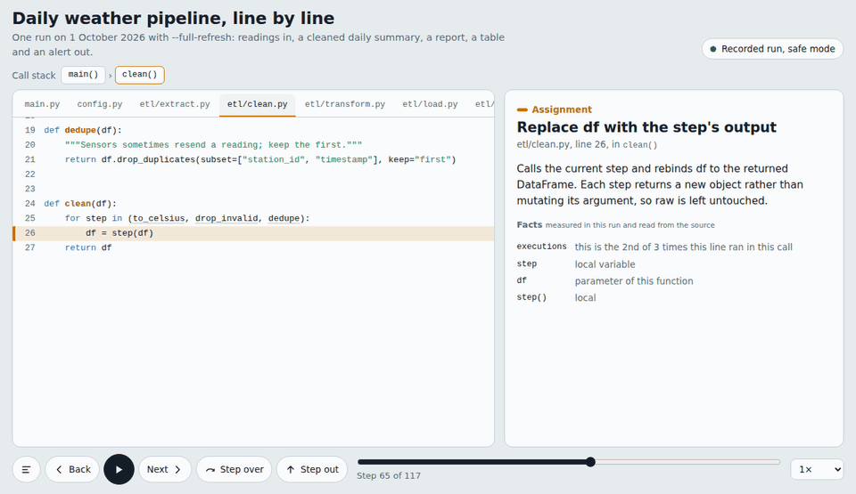

# codestory

Turns a Python program into an animation of how it works. The result is one HTML file that opens in any
browser, offline, and can be shared like a document.

It has two **views**:

- **Story** (default): the story of the data, for anyone. What the program imports, the settings it reads, the
  data it loads, every transformation, the decisions it makes and what it writes, scene by scene.
- **Walkthrough**: the code, line by line, for programmers. A debugger-style replay: every statement explained,
  where every name comes from, and the values before and after each line.

And two **modes**:

- **`scan`** reads the code without running it, and shows every path it can take. Use it to explain a codebase.
- **`run`** records one real run, in a safe mode that keeps side effects in a sandbox, and shows what actually
  happened: which branches ran and how much data was read, filtered, transformed and written. Use it when the
  data or the outcome changes from day to day.




## Watch a demo

Finished examples, playable in your browser:

| Program | Story | Walkthrough |
|---|---|---|
| **Daily weather pipeline**: 601 sensor readings are cleaned, summarized per station, saved to a report and a database, and trigger an alert, all held in safe mode | [Story of a run](https://ansh-saran-sharma.github.io/codestory/examples/weather-pipeline/story.html) | [Line by line, a run](https://ansh-saran-sharma.github.io/codestory/examples/weather-pipeline/walkthrough.html) |
| **Nightly web error check**: counts failed requests per endpoint and emails on-call when too many fail | [Story of every path](https://ansh-saran-sharma.github.io/codestory/examples/log-check-scan/story.html) | [Line by line, every path](https://ansh-saran-sharma.github.io/codestory/examples/log-check-scan/walkthrough.html) |
| **Nightly stock check**: works out which of 40 products need reordering and groups the orders by supplier | | [Line by line, a run](https://ansh-saran-sharma.github.io/codestory/examples/stock-check/walkthrough.html) |

In a story, press space to play or pause and the arrow keys to move between scenes; click any card to see its
code and data. In a walkthrough, → and ← step forward and back, ↓ steps over a call and ↑ steps out of one; click
any underlined name to see its definition. The source projects, bundles and documents are in
[`examples/`](examples/).

## Contents

1. Install
2. Use it from your AI assistant
3. Use it from the command line
4. Story or walkthrough? scan or run?
5. Safe mode
6. What the bundle contains
7. Troubleshooting
8. Files
9. Contributing
10. License

## 1. Install

The folder is an [Agent Skill](https://agentskills.io): `SKILL.md` plus the files it uses. Keep the folder
name `codestory`.

| Assistant | Where to put the folder |
|---|---|
| Claude Code | `~/.claude/skills/codestory/` (all projects) or `<project>/.claude/skills/codestory/` |
| GitHub Copilot in VS Code | `<project>/.github/skills/codestory/` (Copilot also reads `.claude/skills/` and `.agents/skills/`) |
| OpenAI Codex, Cursor, Gemini CLI and other Agent Skills tools | `<project>/.agents/skills/codestory/` or that tool's personal skills folder |
| claude.ai | Upload `codestory.skill` (or the zip) as a custom skill in settings |
| ChatGPT and other chat assistants | Use its skills feature if your plan has one. Otherwise, use a project or custom GPT: paste `SKILL.md` into the instructions and add the other files as knowledge files |

Requirements: Python 3.8 or later. `codestory.py` uses only the standard library, so there is nothing to
`pip install`.

## 2. Use it from your AI assistant

**[USAGE.md](USAGE.md) has step-by-step instructions and examples for every mode, option and assistant.**
The short version:

You invoke codestory with a chat message, and the assistant runs `codestory.py` for you. The command is the
same everywhere (in OpenAI Codex, write `$codestory`):

```
/codestory [scan | run] <entry> [--view story | walkthrough] [options] [-- program arguments]
```

```
/codestory scan main.py --audience stakeholders                    explain the code, nothing is executed
/codestory run main.py -- --date 2026-10-01                        show what one real run did, in safe mode
/codestory run -m etl.cli --live -- --full-refresh                 a module, with real side effects
/codestory codestory_bundle.json --out today.html                  make a story from a bundle you already have
/codestory run main.py --view walkthrough -- --date 2026-10-01     replay that run line by line
/codestory scan main.py --view walkthrough --focus clean           walk through one function's code
```

Only `<entry>` is required (a script, `-m module`, or a bundle file), so `/codestory main.py` is a complete
request. Everything in `[brackets]` is optional and has a default:

| Part | Required? | Default if left out |
|---|---|---|
| `<entry>` | **Required** | — |
| `scan` / `run` | Optional | Chosen from your wording; `scan` if unclear |
| `--view story` / `--view walkthrough` | Optional | `story`, unless you ask for line-by-line detail |
| `--focus TARGET` (walkthrough only) | Optional | The whole program |
| `--max-steps N` (walkthrough only) | Optional | 150 statements get written explanations |
| `--audience TEXT` | Optional | A mixed audience (story); programmers (walkthrough) |
| `--out FILE` | Optional | `story.html` or `walkthrough.html` |
| `--root DIR` | Optional | The current folder, or the entry's folder |
| `--budget N` | Optional | 240,000 characters of source code |
| `--live` (`run` only) | Optional | Off: safe mode sandboxes side effects |
| `--allow-subprocess` (`run` only) | Optional | Off: your program can't start other programs |
| `-- ...` (`run` only) | Only if your program needs arguments | Your program runs with no arguments |

Plain words work just as well: "Explain how main.py works for our product manager", "Show me what main.py
did with --date 2026-10-01", or "Step through clean() line by line".

Where you type the options depends on the assistant:

- **Agents** (Claude Code, GitHub Copilot in Agent mode, OpenAI Codex, Cursor, Gemini CLI) run commands on
  your computer, so everything goes in the chat. For `run`, the agent shows you the exact command and waits
  for your OK before executing your program.
- **Chat assistants** (claude.ai, ChatGPT) can't run your program on your computer. For `scan`, upload your
  code and send the command. For `run`, record it in your terminal first, then upload the bundle:
  ```bash
  python codestory.py run main.py -- --date 2026-10-01       # in your terminal, virtualenv active
  ```
  ```
  /codestory codestory_bundle.json --audience stakeholders    # in the chat, with the bundle uploaded
  ```
  For a walkthrough, add `--view walkthrough` to the terminal command: it's chosen when recording.

## 3. Use it from the command line

The same three steps the assistant performs:

```bash
# 1. Record (pick one; everything after the script name is optional). Run with your project's Python environment active.
python codestory.py scan main.py                        # explain the code: nothing is executed
python codestory.py run  main.py -- --date 2026-10-01   # one real run; arguments for your program go after --
#    add --view walkthrough to either, for a line-by-line walkthrough

# 2. Give codestory_bundle.json to your assistant, which writes storyboard.json (or walkthrough.json)

# 3. Build one shareable HTML file
python codestory.py build storyboard.json -o story.html
python codestory.py build walkthrough.json --bundle codestory_bundle.json -o walkthrough.html
```

Required: for `scan` and `run`, the script or `-m MODULE` (one of the two); for `build`, the document, plus
`--bundle` for a walkthrough. Everything else is optional:

| Command | Argument or option | Required? | Default if left out | What it does |
|---|---|---|---|---|
| `scan`, `run` | `script.py` or `-m MODULE` | **Required (one of the two)** | — | What to record; `-m` works like `python -m MODULE` |
| `scan`, `run` | `-o FILE` | Optional | `codestory_bundle.json` | Bundle file name |
| `scan`, `run` | `--root DIR` | Optional | The current folder, or the entry's folder | Project root |
| `scan`, `run` | `--budget N` | Optional | 240,000 | Maximum characters of source code in the bundle |
| `scan`, `run` | `--view story\|walkthrough` | Optional | `story` | `walkthrough` adds the statement map and step plan, and for `run` records line by line |
| `scan`, `run` | `--focus TARGET` | Optional | The whole program | Walkthrough only: files or functions to cover, comma-separated |
| `scan`, `run` | `--max-steps N` | Optional | 150 | Walkthrough only: how many statements are suggested for written explanations |
| `run` | `--live` | Optional | Off (safe mode on) | Writes, posts and emails really happen |
| `run` | `--allow-subprocess` | Optional | Off | Let the program start other programs in safe mode |
| `run` | `-- ARGS` | Only if your program needs them | No arguments | Arguments for your program |
| `build` | `storyboard.json` or `walkthrough.json` | **Required** | — | The document to play |
| `build` | `--bundle FILE` | **Required for a walkthrough** | — | The bundle the walkthrough was written from |
| `build` | `-o FILE` | Optional | `story.html`, or `walkthrough.html` | Output file name |
| `build` | `--force` | Optional | Off | Build even if the document has problems (not recommended) |

Watching a story: space plays and pauses; the left and right arrows move between scenes; Home and End jump to
the start and end. Click any card to see its code, columns and sample rows. Click a station on the line at
the top to jump to that scene.

Watching a walkthrough: space plays and pauses; → and ← step forward and back; ↓ steps over a call and ↑ steps
out of the current function; O opens the outline. Click an underlined name to see where it's defined, then
"Back to the current step".

## 4. Story or walkthrough? scan or run?

| | Story view | Walkthrough view |
|---|---|---|
| For | anyone: colleagues, managers, new team members | programmers |
| Follows | the data, scene by scene | the code, statement by statement |
| Shows | what each step does to the data, in plain language, with the code on every card | every statement explained, where each name comes from, values before and after each line, calls and returns |
| Length | about 8–16 scenes | one step per statement that runs (long loops collapse after the first iteration); `--focus` narrows it |
| Recording cost in `run` | close to a normal run | 2–10 times a normal run, because every line is recorded |

| | `scan` | `run` |
|---|---|---|
| Use it to | explain the whole flow to someone | see what happened on a particular day |
| Executes your code | no | yes, in safe mode by default |
| Needs your environment (packages, data, database access) | no | yes |
| Branches | all shown as possible | taken path solid, others greyed |
| Data | names and types only | row counts, columns and samples at each step |
| Dynamic calls (registries, `getattr`) | may be missed | captured |

## 5. Safe mode (default for `run`)

Your code is never edited. codestory launches it the way `python main.py` would and watches from outside.

| Side effect | What safe mode does |
|---|---|
| File writes, folder creation, deletes, renames | redirected to a temporary sandbox folder; later reads see the sandbox copy |
| SQLite | the program works on a copy of the database file in the sandbox |
| PostgreSQL (psycopg2, psycopg), MySQL (pymysql) | INSERT/UPDATE/DELETE and schema changes are not sent; they are saved to `db_writes/*.jsonl` in the sandbox. SELECTs run normally |
| HTTP POST/PUT/PATCH/DELETE (requests, httpx, urllib) | blocked; the program receives a fake 200 OK. GETs run normally |
| Email (smtplib) | blocked and recorded |
| Starting other programs | blocked unless `--allow-subprocess` |

Reads really happen: input files are read, SELECT queries run, and GET requests reach the API. Point the
program at test data or a dev database if even reads matter.

Limits:
- A read that comes after a shadowed write to a server database does not see the shadowed rows. codestory
  flags this in the story.
- `INSERT ... RETURNING` cannot return real ids.
- Cloud SDKs (boto3, Google Cloud, Azure), MongoDB, Redis and Kafka are not intercepted yet. codestory warns
  when it sees them.
- The PostgreSQL and MySQL interception has been tested with a simulated driver only. Try it against a dev
  database before relying on it.

## 6. What the bundle contains

Structure (imports, constants, functions, call graph, I/O sites), and for `run` a call tree with timings
and a summary of each argument and return value: shape, columns, dtypes and 3 sample rows for tables, never
the full data. Values that look like secrets are masked. Source code is included for the functions that
matter, within a size budget, so large repositories stay small: only code reachable from the entry point is
read. Full field reference: `references/bundle-format.md`.

Check the bundle before uploading it to a chat assistant if your data is sensitive. It contains sample rows.

## 7. Troubleshooting

| Problem | Fix |
|---|---|
| `ModuleNotFoundError` during `run` | Activate your project's virtualenv (or conda env) first. codestory must run with the same Python as your program. |
| The assistant doesn't use the skill | Check the folder location and that `SKILL.md` sits directly inside `codestory/`. Mention it by name (`/codestory`, or `$codestory` in Codex). |
| Copilot can't run the command | Switch Copilot Chat to Agent mode and allow terminal commands. |
| The story file shows "Open a storyboard" | It's the empty player. Build with `codestory.py build`, or drop `storyboard.json` onto it. |
| `build` reports storyboard or walkthrough problems | Paste the messages back to the assistant and ask it to fix the document. For a walkthrough, "no such statement in the bundle" usually means the code changed after recording: record again. |
| "this bundle has no walkthrough" | The bundle was recorded without `--view walkthrough`. Record again with it. |
| A walkthrough `run` is slow | Line-by-line recording costs time in tight Python loops. Use `--focus` to record only the part you need. |
| The walkthrough file shows "Open a walkthrough" | It's the empty player. Build with `codestory.py build walkthrough.json --bundle codestory_bundle.json`. |
| Fonts look plain | Stories load the Overpass font from Google Fonts when online and use system fonts offline. The story still works. |
| A side effect really happened | Look for "REAL side effect" lines in the `run` output and `real_effects` in the bundle. If safe mode should have caught it, please report the library involved. |

## 8. Files

- `USAGE.md`: how to invoke codestory in each assistant, with examples for every mode and option.
- `SKILL.md`: instructions that teach the assistant to write a good storyboard or walkthrough from a bundle.
- `references/bundle-format.md`, `references/example-storyboard.json`, `references/walkthrough-guide.md`: read by
  the assistant when needed.
- `codestory.py`: scan, run, build. Python 3.8+, standard library only.
- `player.html`: the story player. `walkthrough.html`: the walkthrough player. Both are single files with no
  third-party code. The walkthrough's design is in [docs/walkthrough-spec.md](docs/walkthrough-spec.md).
- `engine.js`: codestory's own animation engine, shared by both players; `build` embeds it in every story.
- `storyboard.schema.json`, `walkthrough.schema.json`: the formats the assistant writes for each view.
- `examples/weather-pipeline/`: a `run` of a pandas + SQLite pipeline, as a story and a walkthrough.
- `examples/log-check-scan/`: a `scan` of a stdlib-only log checker, as a story and a walkthrough.
- `examples/stock-check/`: a `run` of a stdlib-only stock-reorder job, as a walkthrough.
- `tests/`: the test suite (`python -m unittest discover tests`).
- `docs/demo.gif`, `docs/walkthrough-demo.gif`: the animations at the top of this page.

## 9. Contributing

Bug reports and ideas are welcome, especially a library safe mode missed or a story that came out wrong.
See [CONTRIBUTING.md](CONTRIBUTING.md). Report security problems privately, as described in
[SECURITY.md](SECURITY.md). Changes are listed in [CHANGELOG.md](CHANGELOG.md).

## 10. License

[MIT](LICENSE). The whole project, including both players and the animation engine, is original code under this
license. Stories
request the [Overpass](https://fonts.google.com/specimen/Overpass) fonts from Google Fonts when viewed online;
the fonts are not included in this repository.
