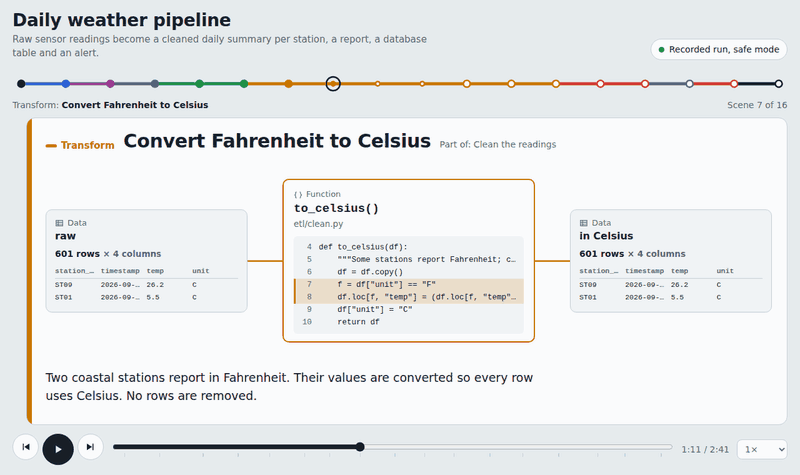

# codestory

Turns a Python program into an animated story of how it works: what it imports, the settings it reads,
the data it loads, every transformation, the decisions it makes, and what it writes. The result is one
HTML file that plays like a video, steps like a slideshow, and opens in any browser, offline.

It works in two modes:

- **`scan`** explains the code: every path it can take, without running anything. Use it to walk a colleague
  or stakeholder through a codebase.
- **`run`** shows what actually happened in one real run: which branches were taken and how many rows were
  read, filtered, transformed and written. Use it when the data or the outcome changes from day to day.



## Watch a demo

Two finished stories, playable in your browser:

- **[Daily weather pipeline](https://YOUR-GITHUB-USERNAME.github.io/codestory/examples/weather-pipeline/story.html)**,
  a `run`: 601 sensor readings are cleaned, summarized per station, saved to a report and a database, and
  trigger an alert, all held in safe mode.
- **[Nightly web error check](https://YOUR-GITHUB-USERNAME.github.io/codestory/examples/log-check-scan/story.html)**,
  a `scan`: every path through a log checker that emails on-call when too many requests fail, without
  running it.

Press space to play or pause, use the arrow keys to move between scenes, and click any card to see its code
and data. The source projects, bundles and storyboards are in [`examples/`](examples/).

## Contents

1. Install
2. Use it from your AI assistant
3. Use it from the command line
4. scan or run?
5. Safe mode
6. What the bundle contains
7. Troubleshooting
8. Files
9. Contributing
10. License

## 1. Install

The folder is an [Agent Skill](https://agentskills.io): `SKILL.md` plus the files it uses. Keep the folder
name `codestory`.

| Assistant | Where to put the folder |
|---|---|
| Claude Code | `~/.claude/skills/codestory/` (all projects) or `<project>/.claude/skills/codestory/` |
| GitHub Copilot in VS Code | `<project>/.github/skills/codestory/` (Copilot also reads `.claude/skills/` and `.agents/skills/`) |
| OpenAI Codex, Cursor, Gemini CLI and other Agent Skills tools | `<project>/.agents/skills/codestory/` or that tool's personal skills folder |
| claude.ai | Upload `codestory.skill` (or the zip) as a custom skill in settings |
| ChatGPT and other chat assistants | Use its skills feature if your plan has one. Otherwise, use a project or custom GPT: paste `SKILL.md` into the instructions and add the other files as knowledge files |

Requirements: Python 3.8 or later. `codestory.py` uses only the standard library, so there is nothing to
`pip install`.

## 2. Use it from your AI assistant

**[USAGE.md](USAGE.md) has step-by-step instructions and examples for every mode, option and assistant.**
The short version:

You invoke codestory with a chat message, and the assistant runs `codestory.py` for you. The command is the
same everywhere (in OpenAI Codex, write `$codestory`):

```
/codestory [scan | run] <entry> [options] [-- program arguments]
```

```
/codestory scan main.py --audience stakeholders        explain the code, nothing is executed
/codestory run main.py -- --date 2026-10-01            show what one real run did, in safe mode
/codestory run -m etl.cli --live -- --full-refresh     a module, with real side effects
/codestory codestory_bundle.json --out today.html      make a story from a bundle you already have
```

Only `<entry>` is required (a script, `-m module`, or a bundle file), so `/codestory main.py` is a complete
request. Everything in `[brackets]` is optional and has a default:

| Part | Required? | Default if left out |
|---|---|---|
| `<entry>` | **Required** | — |
| `scan` / `run` | Optional | Chosen from your wording; `scan` if unclear |
| `--audience TEXT` | Optional | A mixed audience |
| `--out FILE` | Optional | `story.html` |
| `--root DIR` | Optional | The current folder, or the entry's folder |
| `--budget N` | Optional | 240,000 characters of source code |
| `--live` (`run` only) | Optional | Off: safe mode sandboxes side effects |
| `--allow-subprocess` (`run` only) | Optional | Off: your program can't start other programs |
| `-- ...` (`run` only) | Only if your program needs arguments | Your program runs with no arguments |

Plain words work just as well: "Explain how main.py works for our product manager" or "Show me what main.py
did with --date 2026-10-01".

Where you type the options depends on the assistant:

- **Agents** (Claude Code, GitHub Copilot in Agent mode, OpenAI Codex, Cursor, Gemini CLI) run commands on
  your computer, so everything goes in the chat. For `run`, the agent shows you the exact command and waits
  for your OK before executing your program.
- **Chat assistants** (claude.ai, ChatGPT) can't run your program on your computer. For `scan`, upload your
  code and send the command. For `run`, record it in your terminal first, then upload the bundle:
  ```bash
  python codestory.py run main.py -- --date 2026-10-01       # in your terminal, virtualenv active
  ```
  ```
  /codestory codestory_bundle.json --audience stakeholders    # in the chat, with the bundle uploaded
  ```

## 3. Use it from the command line

The same three steps the assistant performs:

```bash
# 1. Record (pick one; everything after the script name is optional). Run with your project's Python environment active.
python codestory.py scan main.py                        # explain the code: nothing is executed
python codestory.py run  main.py -- --date 2026-10-01   # one real run; arguments for your program go after --

# 2. Give codestory_bundle.json to your assistant, which writes storyboard.json

# 3. Build one shareable HTML file
python codestory.py build storyboard.json -o story.html
```

Required: for `scan` and `run`, the script or `-m MODULE` (one of the two); for `build`, the storyboard file.
Everything else is optional:

| Command | Argument or option | Required? | Default if left out | What it does |
|---|---|---|---|---|
| `scan`, `run` | `script.py` or `-m MODULE` | **Required (one of the two)** | — | What to record; `-m` works like `python -m MODULE` |
| `scan`, `run` | `-o FILE` | Optional | `codestory_bundle.json` | Bundle file name |
| `scan`, `run` | `--root DIR` | Optional | The current folder, or the entry's folder | Project root |
| `scan`, `run` | `--budget N` | Optional | 240,000 | Maximum characters of source code in the bundle |
| `run` | `--live` | Optional | Off (safe mode on) | Writes, posts and emails really happen |
| `run` | `--allow-subprocess` | Optional | Off | Let the program start other programs in safe mode |
| `run` | `-- ARGS` | Only if your program needs them | No arguments | Arguments for your program |
| `build` | `storyboard.json` | **Required** | — | The storyboard to play |
| `build` | `-o FILE` | Optional | `story.html` | Story file name |
| `build` | `--force` | Optional | Off | Build even if the storyboard has problems (not recommended) |

Watching a story: space plays and pauses; the left and right arrows move between scenes; Home and End jump to
the start and end. Click any card to see its code, columns and sample rows. Click a station on the line at
the top to jump to that scene.

## 4. scan or run?

| | `scan` | `run` |
|---|---|---|
| Use it to | explain the whole flow to someone | see what happened on a particular day |
| Executes your code | no | yes, in safe mode by default |
| Needs your environment (packages, data, database access) | no | yes |
| Branches | all shown as possible | taken path solid, others greyed |
| Data | names and types only | row counts, columns and samples at each step |
| Dynamic calls (registries, `getattr`) | may be missed | captured |

## 5. Safe mode (default for `run`)

Your code is never edited. codestory launches it the way `python main.py` would and watches from outside.

| Side effect | What safe mode does |
|---|---|
| File writes, folder creation, deletes, renames | redirected to a temporary sandbox folder; later reads see the sandbox copy |
| SQLite | the program works on a copy of the database file in the sandbox |
| PostgreSQL (psycopg2, psycopg), MySQL (pymysql) | INSERT/UPDATE/DELETE and schema changes are not sent; they are saved to `db_writes/*.jsonl` in the sandbox. SELECTs run normally |
| HTTP POST/PUT/PATCH/DELETE (requests, httpx, urllib) | blocked; the program receives a fake 200 OK. GETs run normally |
| Email (smtplib) | blocked and recorded |
| Starting other programs | blocked unless `--allow-subprocess` |

Reads really happen: input files are read, SELECT queries run, and GET requests reach the API. Point the
program at test data or a dev database if even reads matter.

Limits:
- A read that comes after a shadowed write to a server database does not see the shadowed rows. codestory
  flags this in the story.
- `INSERT ... RETURNING` cannot return real ids.
- Cloud SDKs (boto3, Google Cloud, Azure), MongoDB, Redis and Kafka are not intercepted yet. codestory warns
  when it sees them.
- The PostgreSQL and MySQL interception has been tested with a simulated driver only. Try it against a dev
  database before relying on it.

## 6. What the bundle contains

Structure (imports, constants, functions, call graph, I/O sites), and for `run` a call tree with timings
and a summary of each argument and return value: shape, columns, dtypes and 3 sample rows for tables, never
the full data. Values that look like secrets are masked. Source code is included for the functions that
matter, within a size budget, so large repositories stay small: only code reachable from the entry point is
read. Full field reference: `references/bundle-format.md`.

Check the bundle before uploading it to a chat assistant if your data is sensitive. It contains sample rows.

## 7. Troubleshooting

| Problem | Fix |
|---|---|
| `ModuleNotFoundError` during `run` | Activate your project's virtualenv (or conda env) first. codestory must run with the same Python as your program. |
| The assistant doesn't use the skill | Check the folder location and that `SKILL.md` sits directly inside `codestory/`. Mention it by name (`/codestory`, or `$codestory` in Codex). |
| Copilot can't run the command | Switch Copilot Chat to Agent mode and allow terminal commands. |
| The story file shows "Open a storyboard" | It's the empty player. Build with `codestory.py build`, or drop `storyboard.json` onto it. |
| `build` reports storyboard problems | Paste the messages back to the assistant and ask it to fix the storyboard. |
| Fonts look plain | Stories load the Overpass font from Google Fonts when online and use system fonts offline. The story still works. |
| A side effect really happened | Look for "REAL side effect" lines in the `run` output and `real_effects` in the bundle. If safe mode should have caught it, please report the library involved. |

## 8. Files

- `USAGE.md`: how to invoke codestory in each assistant, with examples for every mode and option.
- `SKILL.md`: instructions that teach the assistant to write a good storyboard from a bundle.
- `references/bundle-format.md`, `references/example-storyboard.json`: read by the assistant when needed.
- `codestory.py`: scan, run, build. Python 3.8+, standard library only.
- `player.html`: the player, with its own small animation engine. One file, no third-party code, works in
  any modern browser.
- `storyboard.schema.json`: the contract between the assistant and the player.
- `examples/weather-pipeline/`: a `run` of a pandas + SQLite pipeline, with its bundle, storyboard and story.
- `examples/log-check-scan/`: a `scan` of a stdlib-only log checker, with its bundle, storyboard and story.
- `docs/demo.gif`: the animation at the top of this page.

## 9. Contributing

Bug reports and ideas are welcome, especially a library safe mode missed or a story that came out wrong.
See [CONTRIBUTING.md](CONTRIBUTING.md). Report security problems privately, as described in
[SECURITY.md](SECURITY.md). Changes are listed in [CHANGELOG.md](CHANGELOG.md).

## 10. License

[MIT](LICENSE). The whole project, including the player, is original code under this license. Stories
request the [Overpass](https://fonts.google.com/specimen/Overpass) fonts from Google Fonts when viewed online;
the fonts are not included in this repository.
